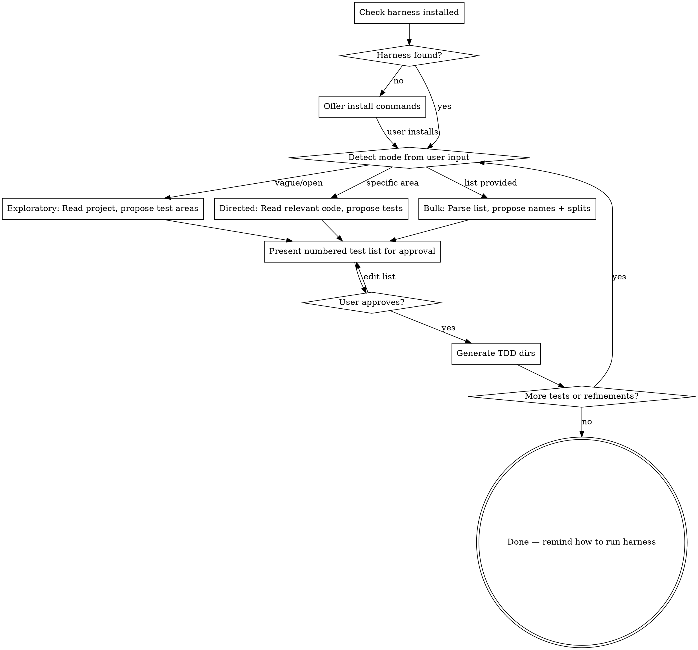

# Write TDD Specs — Define What to Build

Spec out features and functionality as TDD test specifications. The harness will then spawn Claude Code sessions to **write the implementation code** for each spec. This is a code generation system, not a test runner — the specs define what to build, the tests just verify it got built correctly.

## Harness Setup

Before writing tests, verify the harness is available. Run `which harness` via Bash.

**If `harness` is not found**, tell the user and offer to install it:

```bash
# Requires Go installed
git clone https://github.com/jgatt493/jg-mini-harness.git /tmp/jg-mini-harness
cd /tmp/jg-mini-harness && go build -o harness ./cmd/harness
cp /tmp/jg-mini-harness/harness /usr/local/bin/harness
rm -rf /tmp/jg-mini-harness
```

Present these commands to the user and let them run it. Do NOT execute the install yourself — the user handles setup.

**If `harness` is found**, run `harness version` to show the user which version they have, then proceed to writing tests.

**Updating the harness binary:**
If the user asks to update, or if you suspect the binary is outdated, give them these commands:
```bash
cd /tmp && git clone https://github.com/jgatt493/jg-mini-harness.git && cd jg-mini-harness && go build -o harness ./cmd/harness && cp harness /usr/local/bin/harness && rm -rf /tmp/jg-mini-harness && harness version
```

After tests are generated, remind the user how to run:
```bash
harness run                    # from project root, scans ./TDD
harness run --retry-failed     # re-run failed tests
harness version                # check installed version
```

## When to Use

- User wants to spec out new features or functionality
- User says "I want to add X", "build X", "spec out X"
- User provides a list of features/requirements to build
- User wants to explore what to build next in a project
- User wants to break down, refine, or edit existing specs

## Process



## Before Starting

1. **Check harness** — `which harness` to verify it's installed
2. **Ask the user what they want to build.** Do NOT start reading the project or generating specs until the user has told you what they're looking for. Ask a simple question like: "What do you want to build or add? I can look at the project and suggest features, focus on a specific area, or you can give me a list of what you want."
3. Once you know the mode, **then** read the project, check existing TDD/, and identify the test runner.

**NEVER start exploring or generating without asking the user first.** Even if the request seems obvious, confirm before doing work.

## Detecting Mode

**Exploratory** — User gives a vague request ("what should I build next?", "spec out this app"):
- Scan the full project structure and source code
- Identify features to add, gaps to fill, improvements to make
- Propose a comprehensive numbered list of things to build

**Directed** — User names a specific feature ("add a login system", "I need caching"):
- Read the relevant source code deeply
- Propose specs for that feature, broken into buildable units

**Bulk Import** — User provides a list of features/requirements:
- Parse each item into a spec
- Suggest splitting items that are too broad (multiple concerns in one spec)
- Suggest merging items that are too narrow

## Presenting the Test List

Present tests as a numbered list for approval:

```
Proposed tests:

1. **auth-login** — Verify user login with valid credentials returns a session token
2. **auth-login-invalid** — Verify login with bad password returns 401
3. **parse-csv-headers** — Verify CSV parser extracts headers correctly
4. **parse-csv-empty** — Verify CSV parser handles empty files gracefully
```

Ask the user to approve, edit (add/remove/rename/split/merge), or refine before generating.

## Generating Tests

For each approved test, create two files:

### TDD/<test-name>/spec.md

Must be **self-contained** — consumed by `claude -p` in headless mode with no follow-up questions possible.

Every spec MUST include:

- **What to build** — the requirement in plain language, detailed enough to implement without ambiguity
- **Where to put it** — file paths inferred from existing project structure; when ambiguous, state the intent
- **Constraints** — what NOT to do (don't break existing functionality, don't modify unrelated code, don't over-engineer)
- **Acceptance criteria** — what "done" looks like, aligned with `test_cmd`

Example:
```markdown
# Auth Login Endpoint

Create a POST `/api/login` endpoint that accepts `{ email, password }` and returns `{ token }` on success or `401` on failure.

## Requirements
- Add handler in `src/routes/auth.go`
- Validate email format and non-empty password
- Check credentials against the user store in `src/db/users.go`
- Return JSON `{ "token": "<jwt>" }` with 200 on success
- Return JSON `{ "error": "invalid credentials" }` with 401 on failure

## Constraints
- Do not modify existing routes or middleware
- Use the existing `db.FindUser()` function
- Do not add new dependencies

## Acceptance Criteria
- `go test ./src/routes/ -run TestLoginSuccess` passes
- `go test ./src/routes/ -run TestLoginInvalidPassword` passes
```

### TDD/<test-name>/test_cmd

A single-line shell command. The harness reads the first line and executes it via `sh -c`.

Rules:
- Exit 0 = pass, non-zero = fail
- Runs from the directory where `harness run` is executed (the current working directory)
- Must be specific enough to verify this test's requirement
- **NEVER use `cd` in test commands.** All paths must be relative to the current directory. The user runs `harness run` from wherever TDD/ lives — test commands must work from that same directory.

For multi-step verification, chain with `&&`:
```
sh -c "test -f output.txt && grep -q 'hello' output.txt"
```

For project test runners, target specific tests:
```
go test ./src/routes/ -run TestLoginSuccess
```

## Test Command Patterns by Stack

| Stack | Pattern |
|-------|---------|
| Go | `go test ./pkg/... -run TestName` |
| Node/TS | `npx vitest run --reporter=verbose tests/file.test.ts` |
| Python | `pytest tests/test_file.py::test_name -v` |
| Generic file check | `sh -c "test -f path && grep -q 'pattern' path"` |
| Generic HTTP | `sh -c "curl -sf http://localhost:3000/endpoint \| grep -q 'expected'"` |

Read the project to pick the right pattern. If the project already has a test framework configured, use it.

## Duplicate Awareness

Before generating, compare proposed tests against existing `TDD/` directories:
- If a proposed test overlaps with an existing spec, flag it
- Ask the user: skip, replace, or keep both?
- Never silently overwrite existing test specs

## Iteration

After generating, remain available for:
- Adding more tests
- Splitting broad tests into smaller ones
- Making vague specs more specific
- Removing tests that are redundant
- Editing existing `spec.md` or `test_cmd` files

## Common Mistakes

- **Spec too vague** — "make the auth work" gives Claude nothing to implement. Be specific about endpoints, inputs, outputs, file paths.
- **Test command too broad** — `go test ./...` passes if ANY test passes. Target specific test functions.
- **Multiple concerns in one test** — "login and registration and password reset" should be three tests.
- **Missing constraints** — without "don't modify X", Claude may refactor half the codebase to make a test pass.
